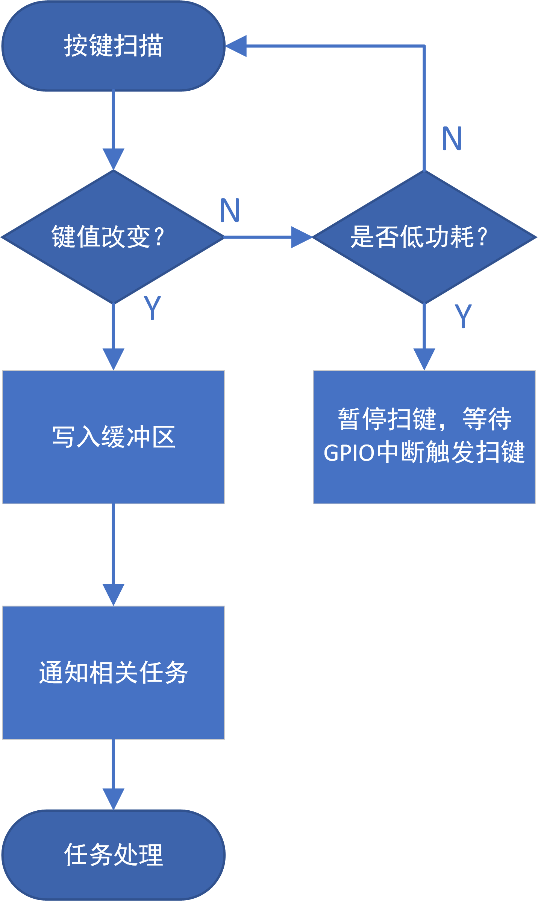

任务管理
##########

软件基本框架如下：

键盘扫描任务
============

按键在工作模式每隔10ms扫描一次，在检测到键值变化后将键值和report id写入环形缓冲区，并根据当前模式（BLE,USB,2.4G）给相关任务发送消息；
若持续若干次（当前为50）未检测到键值变化，则可以将按键扫描任务暂定，并开启GPIO中断，在中断中重新开启按键扫描任务。

数据处理任务
=============

不同的模式有不同的数据处理任务，但大同小异。如当前模式为BLE，那么BLE任务在收到键值消息后开始查询当前缓冲区，若存在键值且解析成功则发送数据。