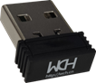

.. _hardware:

硬件设计
############

**注意：使用ISP工具下载时需取消 RST作为手动复位输入引脚功能且使用PB11作为下载配置脚！**

硬件包含键盘和2.4G接收器。

键盘
=====
供电方案
--------
键盘采用USB供电和干电池供电两种供电方式，USB供电使用DCDC降压方案，干电池供电使用DCDC升压方案。

注意USB降压后的电压比干电池升压后的电压略高，目的是在两种供电方式同时存在的时候优先使用USB供电方式。

背光灯方案
----------
可以使用PWM控制板上背光灯，可以使用I2C接口控制其他背光灯模块。

2.4G接收器
==========
2.4G接收器外形如下：

考虑到模具和体积的问题，2.4G接收器并没有提供调试接口，所以在开发调试阶段可使用CH582EVT评估板进行调试。
